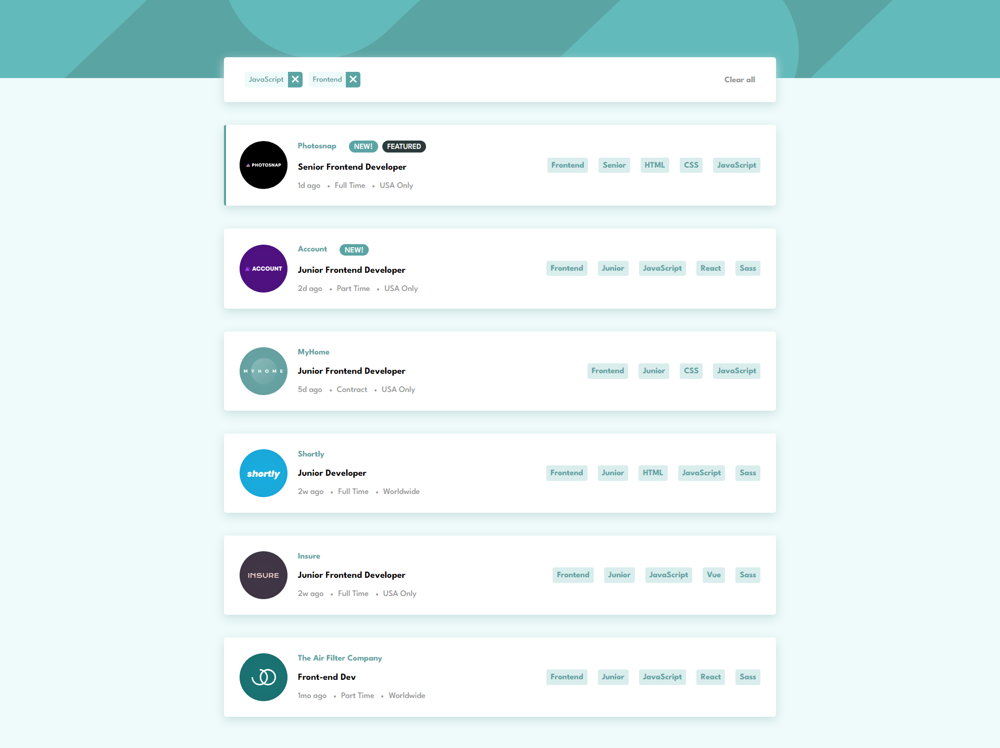

# Frontend Mentor - Job listings with filtering solution

Esta é uma solução para o desafio [Job listings with filtering challenge on Frontend Mentor](https://www.frontendmentor.io/challenges/job-listings-with-filtering-ivstIPCt).

### O desafio :computer: :rocket:

Os usuários devem ser capazes de:

- Filtrar as ofertas de emprego com base nas categorias
- Ver o layout ideal de acordo com o tamanho da tela do seu dispositivo
- Ver os estados de hover de todos os elementos interativos da página

### Screenshot :camera:

### Links

- Link do repositório: [https://github.com/gbmouraa/job_listings](https://github.com/gbmouraa/job_listings)
- Link do site: [https://gbmoura-jobslist.netlify.app/](https://gbmoura-jobslist.netlify.app/)

### Projeto construido com :hammer:

- **Javascript**
- **styled-components** - Para os estilos
- **React** - Lib Javascript
- **Framer Motion** - Lib para animações

## Autor :raising_hand:

- **Website** - [Gabriel M.](https://gmouradev.netlify.app/)
- **Frontend Mentor** - [@gbmouraa](https://www.frontendmentor.io/profile/gbmouraa)
- **Linkedin** - [Gabriel Moura](https://www.linkedin.com/in/gabriel-moura-b63382161/)
